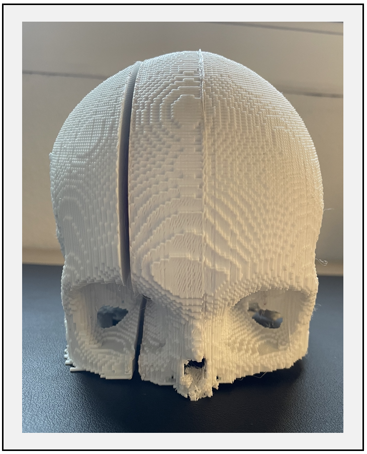

<p align="center" width="100%">
    
</p>
<p align="center" width="100%">
    
</p>

# Segmentació de lesions cerebrals procedents d'imatges mèdiques, per la seva posterior digitalització i impressió en 3D
Treball Final de Grau (TFG) del grau d'enginyeria biomèdica de la Universitat de Girona.

**Autor:** Xavier Beltran Urbano

## PROPÒSIT
La finalitat d'aquest projecte és desenvolupar mètodes d'ajuda per realitzar un preoperatori d'una manera més personalitzada i completa. Concretament, els mètodes que s'han desenvolupat consisteixen en programes  de segmentació del tumor, on per acomplir aquesta tasca, s'han utilitzat algoritmes no supervisats (K-Means) així com tècniques supervisades basades en xarxes neuronals convolucionals (CNNs). Un cop segmentat el tumor, aquest s'ha digitalitzat i imprès en 3D juntament amb el crani del pacient en qüestió.

## REQUERIMENTS D'INSTAL·LACIÓ

Els requeriments per poder executar aquest projecte són els següents:
- CuDNN 7.6.5
- MATLAB R2022a
- SPM12
- Ultimaker Cura
- Plugin Custom Supports
- 3D Builder
- Python 3.6.9
- Tensorflow 1.12
- Numpy 1.19.5
- Matplotlib 3.3.4
- NiBabel 3.2.2
- tqdm 4.63.0
- OpenCV 4.5.5.64
- scikit-image 0.17.2
- pandas 1.1.5
- SciPy 1.4.0
- Funció '_ImHausdorff_' [(Pàgina web per descarregar la funció)](https://es.mathworks.com/matlabcentral/fileexchange/70522-imhausdorff).
- Funció '_Make STL of 3D array_'[(Pàgina web per descarregar la funció)](https://es.mathworks.com/matlabcentral/fileexchange/68794-make-stl-of-3d-array-optimal-for-3d-printing?s_tid=prof_contriblnk).

## BASE DE DADES

La base de dades utilitzada en el projecte prové del repte internacional conegut com a BraTS. Concretament, hem utilitzat les dades que es van utilitzar  l'any 2018 en aquest repte [(BraTS'18 web)](https://www.med.upenn.edu/sbia/brats2018/registration.html).

## MANUAL D'USUARI

A continuació explicarem detalladament els passos necessaris per tal d'executar aquest projecte. Aquests passos són els següents:

1. Primerament, hem d'obtenir la segmentació del tumor. Per acomplir aquesta tasca, haurem d'utilitzar algun dels models guardats dintre de la carpeta de la de segmentació binària mitjançant Deep Learning [(Clica per anar a la carpeta)](https://github.com/xavibeltranurbano/Treball_Final_de_Grau/tree/main/Segmentació%20del%20tumor/Deep%20Learning/Segmentació%20Binària).
Un cop segmentat el tumor, per tal de convertir aquest en format 'nifti', utilitzarem el següent codi: 


```ruby
import numpy as np
import nibabel as nib

converted_array = numpy.array(normal_array, dtype=numpy.float32) # Canviar normal_array per l'array que volem convertir al format nifti
affine = numpy.eye(4)
nifti_file = nibabel.Nifti1Image(converted_array, affine) 
path_to_save='PATH'
nibabel.save(nifti_file, path_to_save) # Canviar path_to_save pel directori on volem guardar la carpeta. En aquest directori ha d'estar especificat tant el nom de l'arxiu nifti que crearem, com l'extensió d'aquest (.nii o .nii.gz)
```
2. Seguidament, mitjançant MATLAB, executarem el software SPM12 per tal d'obtenir les diferents màscares del pacient en qüestió (segmentació del crani, segmentació de la substància grisa, etc.).

3. Un cop obtingudes les màscares del pacient, utilitzarem el programa anomenat 'Reconstruction3D.m' per tal de realitzar la reconstrucció del tumor i del crani del pacient. Si tot s'ha executat correctament, el programa ens hauria de crear 4 fitxers en format STL:
  - sagital1.stl
  - sagital2.stl
  - transversal1.stl
  - transversal2.stl
  - tumor.stl

3. A continuació, observarem les reconstruccions obtingudes mitjançant el software 3D Builder. Aleshores haurem de fixar-nos si la base del tumor està en contacte amb el crani. En cas negatiu, haurem de col·locar un suport de forma manual. Per acomplir aquesta tasca, simplement haurem d'inserir un cilindre i col·locar-lo de manera que aquest estigui en contacte amb el crani i amb la base del tumor.  
 
 <p align="center" width="100%">
    
</p>
 

4. Seguidament, obrirem els fitxers obtinguts en el pas anterior, mitjançant el software Ultimaker Cura. Aleshores, haurem de col·locar el tumor en orientació cap avall, per tal d'optimitzar la impressió. Un cop reorientat el model, donat que la forma d'aquest no és uniforme, haurem de col·locar diferents suports de forma manual. Per acomplir aquesta tasca, utilitzarem el plugin 'Csutom Supports'. 

<p align="center" width="100%">
    
</p>
Finalment, exportarem el model en format '.gcode'i el guardarem en una memòria USB.

5. Per acabar, col·locarem la memòria USB en la impressora, i començarem a imprimir el model.

6. Donat que el tamany dels models és molt gran, haurem d'imprimir aquests per separat. Per tant, haurem de repetir els passos 3, 4 i 5 per cada model que vulguem imprimir.


## RESULTAT FINAL
### · Model obtingut mitjançant un tall sagital 

<p align="center" width="100%">
    
    
    
</p>

 
 ### · Model obtingut mitjançant un tall transversal 
<p align="center" width="100%">
    
    
</p>

