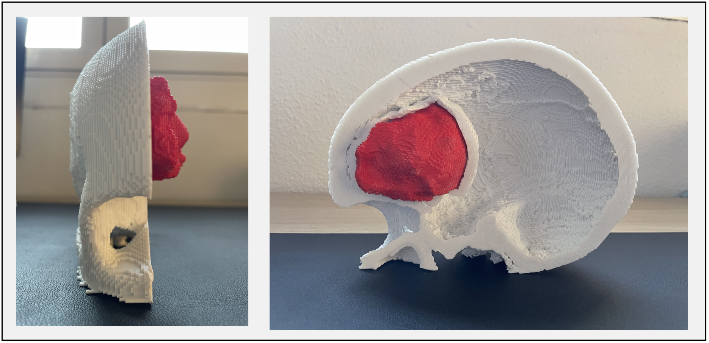
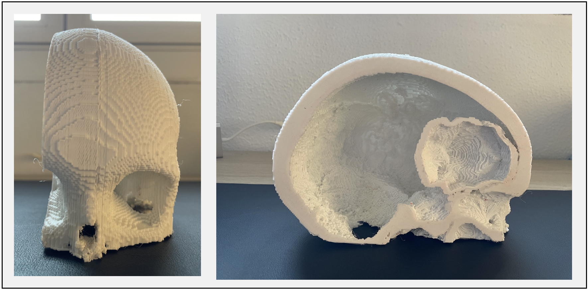
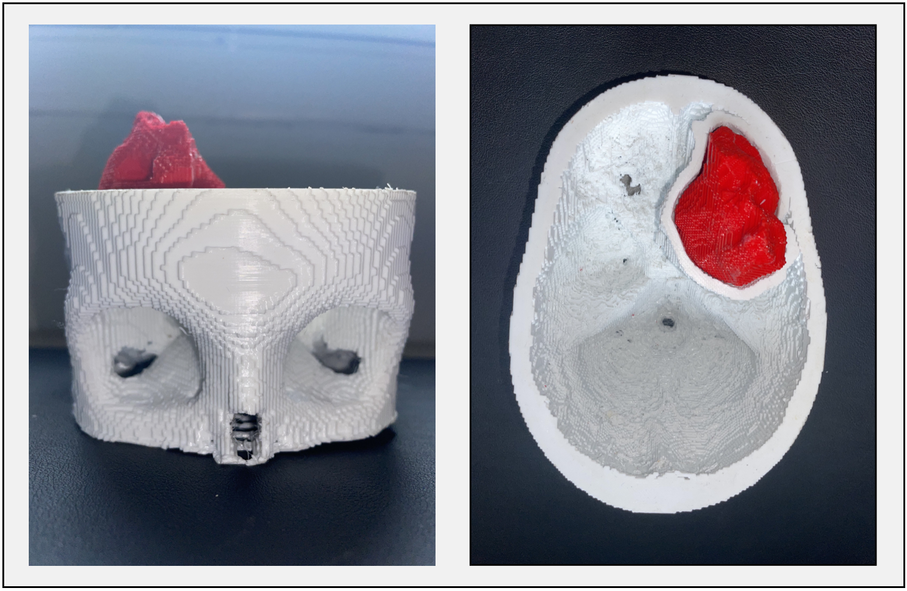
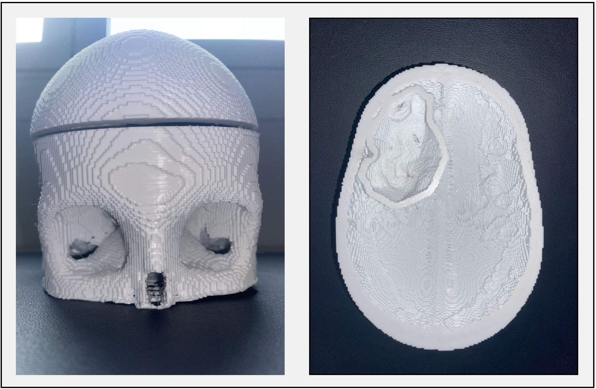

<div id="unique-name" class"row"
<p align="left" width="100%">
    
 <p align="right" width="100%">
    
</p>
</div>

<table border="0" width="95%" height="auto"><tr>
<td><left></left></td>
<td><right></right></td>
</tr></table>

<div id="unique-name" class="row">
<div class="col-md-12">
    
</div>

<div class="col-md-4">
    
</div>

# Segmentació de lesions cerebrals procedents d'imatges mèdiques per la seva posterior digitalització i impressió en 3D
Treball Final de Grau (TFG) del grau d'enginyeria biomèdica de la Universitat de Girona.

## PROPÒSIT 
La finalitat d'aquest projecte és desenvolupar mètodes d'ajuda per realitzar un preoperatori d'una manera més personalitzada i completa. Concretament, els mètodes que s'han desenvolupat consisteixen en mètodes de segmentació del tumor utilitzant IA. Concretament, s'han desenvolupats dos mètodes, els quals acompleixen tasques diferents: el primer d'ells realitza una segmentació binària del tumor (segmentació del tumor sencer)i, el segon realitza una segmentació semàntica del tumor ( segmentació en subregions). Cal destacar que pel desenvolupament dels mètodes que acabem d'esmentar, s'han utilitzat mètodes no supervisats així com tècniques supervisades basades en xarxes neuronals convolucionals (CNNs). Finalment, un cop segmentat el tumor, l'hem digitalitzat i imprimit en 3D  juntament amb el crani del pacient en qüestió.

## REQUERIMENTS D'INSTALACIÓ
Els requeriments per poder executar aquest projecte són els següents:
- CuDNN 7.6.5
- MATLAB R2022a
- Base de dades del BraTS'18 [(BraTS'18 web)](https://www.med.upenn.edu/sbia/brats2018/registration.html)
- Ultimaker Cura
- Plugin Custom Supports
- 3D Builder
- Python 3.6.9
   - Tensorflow 1.12 
   - Numpy 1.19.5 
   - Matplotlib 3.3.4
   - NiBabel 3.2.2
   - tqdm 4.63.0
   - OpenCV 4.5.5.64
   - scikit-image 0.17.2
   - pandas 1.1.5
   - SciPy 1.4.0

## MANUAL D'USUARI

Els diferents passos per executar el present projecte són els següents:
1. Executar els programes encarregats de la segmentació. En cas d'utilitzar l'algoritme K-means, un cop segmentat el tumor, utilitzar la funció 'niftiwrite()' per guardar la segmentació d'aquest, al ordinador. Altrament, utilitzar el següent codi:


```ruby
import numpy as np
import nibabel as nib

converted_array = numpy.array(normal_array, dtype=numpy.float32) # Canviar normal_array per l'array que volem convertir al format nifti
affine = numpy.eye(4)
nifti_file = nibabel.Nifti1Image(converted_array, affine) 
path_to_save='PATH'
nibabel.save(nifti_file, path_to_save) # Canviar path_to_save pel directori on volem guardar la carpeta. En aquest directori ha d'estar especificat tant el nom de l'arxiu nifti que crearem, com la extensió d'aquest (.nii o .nii.gz)
```
2. Un cop obtinguda la segmentació del tumor, utilitzarem el programa anomenat 'Reconstruction3D' per tal de realitzar la reconstrucció del tumor i del crani del pacient. Si tot s'ha executat correctament, el programa ens hauria de crear 4 fitxers en format STL:
- sagital1.stl
- sagital2.stl
- transversal1.stl
- transversal2.stl
- tumor.stl

3. A continuació observarem les reconstruccions obtingudes mitjançant el software 3D Builder. Aleshores haurem de fixar-nos si la base del tumor està en contacte amb el crani, o per contra, està flotant. En cas que aquesta estigui flotant, haurem de col·locar un suport de forma manual. Per acomplir aquesta tasca, simplement haurem de insertar un cilindre i col·locar-lo de manera que aquest estigui en contacte amb el crani i amb la base del tumor.  
 
 <p align="center" width="100%">
    
</p>
 

4. Seguidament, obrirem els fitxers resultants del pas anterior amb el software Ultimaker Cura. Aleshores, haurem de col·locar el tumor en orientació cap a vall, per tal d'optimitzar la impressió. Un cop re-orientat el model, donat que la forma del model no es uniforme, haurem de col·locar diferents suports, de forma manual, pel voltant d'aquest. Per fer això utilitzarem el plugin 'Csutom Supports'. En acabar de col·locar els suports, exportarem el model en format '.gcode'i el guardarem en una memòria USB. Imatges_repositori/Exemple_Suports.png
<p align="center" width="100%">
    
</p>

5. Finalment, col·locarem la memòria USB en la impressora, i començarem a imprimir el model.

6. Donat que el tamany dels models és molt gran, haurem d'imprimir aquests per separat. Per tant, haurem de repetir els passos 3, 4 i 5 per cada model que volguem imprimir.


## Resultat final
### · Model obtingut mitjançant un tall sagital

<p align="center" width="100%">
    
    
    
</p>

 
 ### · Model obtingut mitjançant un tall transversal
<p align="center" width="100%">
    
    
</p>

